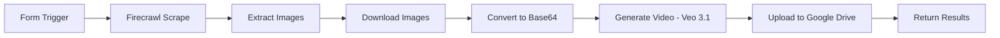

# 🎬 AI E-Commerce Video Automation

[](https://n8n.io)
[](https://firecrawl.dev)
[](https://cloud.google.com)
[](./LICENSE)
[](./docs/CONTRIBUTING.md)

> **Transform static product images into engaging AI-generated videos in minutes**  
> An N8N workflow that automatically scrapes e-commerce product collections, extracts images using Firecrawl AI, and generates professional 8-second looping videos with Google's Veo 3.1—all uploaded to Google Drive without writing code.

---

## 📺 Demo

> **Note:** Add your demo video here once generated!

```
examples/
├── sample-output.mp4         # Example generated product video
├── before-after.png          # Side-by-side comparison
└── workflow-diagram.png      # Visual workflow overview
```

---

## ✨ Key Features

- 🔗 **One-Click Automation** – Submit any e-commerce collection URL via form trigger
- 🤖 **Smart AI Scraping** – Firecrawl extracts product images with AI-powered parsing
- 🎥 **Professional Videos** – Generate 8-second looping videos with Google Veo 3.1
- 📦 **Batch Processing** – Handle entire product catalogs automatically
- ☁️ **Cloud Storage** – Auto-upload to organized Google Drive folders
- 🔧 **No-Code Setup** – Visual N8N workflow, no programming required
- 💰 **Cost-Effective** – ~$0.15-0.30 per video (vs $50-200 traditional videography)
- 🎨 **Customizable** – Adjust prompts, video duration, and output formats

---

## 🛠️ Tech Stack

| Technology | Version | Purpose |
|------------|---------|---------|
| **[N8N](https://n8n.io)** | 1.0+ | Workflow automation engine |
| **[Firecrawl](https://firecrawl.dev)** | API v1 | AI-powered web scraping & extraction |
| **[Google Veo 3.1](https://cloud.google.com/vertex-ai)** | Latest | Text-to-video AI generation |
| **[Google Drive API](https://developers.google.com/drive)** | v3 | Cloud storage & organization |
| **Node.js** | 18+ | Runtime environment (for self-hosted N8N) |

---

## 📋 Prerequisites

Before you begin, ensure you have:

- ✅ **N8N instance** (self-hosted or [n8n.cloud](https://n8n.cloud))
- ✅ **Firecrawl API key** (get free credits at [firecrawl.dev](https://firecrawl.dev))
- ✅ **Google Cloud account** with billing enabled
- ✅ **Vertex AI API** enabled in Google Cloud
- ✅ **Google Drive API** enabled with OAuth credentials
- ✅ Basic understanding of N8N workflows

**Estimated Setup Time:** 20-30 minutes

---

## 🚀 Quick Start

### 1️⃣ Clone This Repository

```bash
git clone https://github.com/LahiruKavishkaYT/ecommerce-video-automation.git
cd ecommerce-video-automation
```

### 2️⃣ Import Workflow to N8N

1. Open your N8N instance
2. Click **"Import from File"** or **"Import from URL"**
3. Select `workflows/product-video-generator.json`
4. The workflow will appear in your canvas

### 3️⃣ Configure API Credentials

Navigate to **Settings > Credentials** and add:

#### **Firecrawl API**
```
Name: Firecrawl Account
API Key: fc_your_api_key_here
```

#### **Google Vertex AI (Veo 3.1)**
```
Name: Google Vertex AI
Project ID: your-gcp-project-id
Service Account JSON: (upload your key file)
Region: us-central1
```

#### **Google Drive**
```
Name: Google Drive OAuth2
Client ID: your-client-id.apps.googleusercontent.com
Client Secret: your-client-secret
Scopes: https://www.googleapis.com/auth/drive.file
```

> **Detailed setup guide:** See [docs/SETUP.md](./docs/SETUP.md)

### 4️⃣ Configure Google Drive Folder

1. Create a folder in Google Drive named `Product Videos`
2. Get the folder ID from the URL:  
   `https://drive.google.com/drive/folders/YOUR_FOLDER_ID_HERE`
3. Paste the folder ID in the **"Google Drive"** node settings

### 5️⃣ Activate the Workflow

1. Click **"Active"** toggle in the top-right corner
2. Copy the webhook URL (shown in the Form Trigger node)
3. Test with a sample e-commerce collection URL

---

## 📖 Detailed Usage

### Input Format

The workflow accepts URLs from major e-commerce platforms:

```
✅ Shopify collections: https://store.com/collections/new-arrivals
✅ WooCommerce: https://store.com/product-category/apparel
✅ Custom stores: Any page with product listings
```

### Workflow Steps



1. **Form Trigger** – Accepts product collection URL
2. **Firecrawl Scrape** – Crawls the page with AI extraction
3. **Extract Images** – Pulls product image URLs from response
4. **Loop Through Products** – Processes each image individually
5. **Download Images** – Fetches full-resolution product photos
6. **Base64 Conversion** – Prepares images for Veo 3.1 API
7. **Generate Video** – Creates 8-second looping videos
8. **Upload to Drive** – Organizes videos in your folder
9. **Response** – Returns success confirmation with links

### Example Request

**Form Submission:**
```json
{
  "collectionUrl": "https://example-store.com/collections/summer-2025"
}
```

**Expected Output:**
```json
{
  "status": "success",
  "processed": 12,
  "videos": [
    {
      "product": "Blue Striped Shirt",
      "driveUrl": "https://drive.google.com/file/d/...",
      "duration": "8s"
    }
    // ... more products
  ]
}
```

---

## ⚙️ Configuration Options

### Firecrawl Extraction Prompt

Customize the AI extraction prompt in the **"Firecrawl"** node:

```javascript
// Default prompt (fashion/apparel)
"Extract all product images from this collection page. Return a JSON array with 'productName' and 'imageUrl' for each item."

// For electronics
"Extract product images focusing on main product shots, excluding lifestyle images or icons."
```

### Veo 3.1 Video Parameters

Modify in the **"HTTP Request"** node (Veo API call):

| Parameter | Default | Options | Purpose |
|-----------|---------|---------|---------|
| `duration` | `8s` | `4s`, `8s`, `12s` | Video length |
| `aspectRatio` | `16:9` | `9:16`, `1:1`, `16:9` | Output dimensions |
| `prompt` | Fashion prompt | Custom text | Video generation instructions |
| `loop` | `true` | `true`, `false` | Seamless looping |

**Example Custom Prompt:**
```
A sleek 360-degree product rotation of {{productName}} on a minimalist white background, studio lighting, professional e-commerce style, no audio
```

### Batch Size

Control how many products process simultaneously (set in Loop node):

- **Small catalogs (1-20 products):** Process all at once
- **Medium (20-100):** Batch size of 10
- **Large (100+):** Batch size of 5 to avoid rate limits

---

## 💰 Cost Breakdown

> **Updated:** October 2025 pricing

| Service | Cost Structure | Example (10 products) |
|---------|---------------|----------------------|
| **Firecrawl** | $0.01 per page scraped | $0.01 |
| **Google Veo 3.1** | ~$0.15-0.25 per 8s video | $1.50-2.50 |
| **Google Drive** | $0.02/GB (after 15GB free) | ~$0.001 (50MB total) |
| **N8N** | Free (self-hosted) or $20/mo | $0 (self-hosted) |
| **Total per product** | — | **$0.15-0.26** |

**Monthly Scenarios:**

- **Small Store** (50 products): ~$8-13/month
- **Medium Brand** (200 products): ~$30-52/month
- **Enterprise** (1000 products): ~$150-260/month

**ROI Comparison:**
- Traditional videography: $50-200 per product
- AI automation: $0.15-0.26 per product
- **Savings:** 99%+ cost reduction

📊 **Full cost analysis:** [docs/API-COSTS.md](./docs/API-COSTS.md)

---

## 🐛 Troubleshooting

### Common Issues

#### Firecrawl returns empty array
```bash
✅ Solution: Check if the URL is publicly accessible
✅ Adjust the extraction prompt to match the site's HTML structure
```

#### Veo 3.1 authentication error
```bash
❌ Error: "Invalid API key format"
✅ Ensure you're using Gemini API key (not service account)
✅ Format: AIzaSy...
```

#### Videos not looping smoothly
```bash
✅ Add to prompt: "ensure first and last frames are identical for seamless looping"
✅ Adjust duration to 8s (optimal for loops)
```

#### Rate limit exceeded
```bash
✅ Add Wait nodes between batch iterations (5-10 seconds)
✅ Reduce batch size in Loop node settings
```

🔧 **Full troubleshooting guide:** [docs/TROUBLESHOOTING.md](./docs/TROUBLESHOOTING.md)

---

## 🎨 Customization

This workflow is highly customizable. Common modifications:

- **Multi-platform support** – Add scrapers for Amazon, Etsy, eBay
- **Video variations** – Generate multiple aspect ratios per product
- **Social media integration** – Auto-post to Instagram, TikTok, Pinterest
- **Watermarking** – Add your brand logo to videos
- **Email notifications** – Alert when batches complete

📝 **Customization guide:** [docs/CUSTOMIZATION.md](./docs/CUSTOMIZATION.md)

---

## 🤝 Contributing

Contributions are welcome! Please follow these steps:

1. Fork the repository
2. Create a feature branch (`git checkout -b feature/AmazingFeature`)
3. Commit your changes (`git commit -m 'Add AmazingFeature'`)
4. Push to the branch (`git push origin feature/AmazingFeature`)
5. Open a Pull Request

**Ideas for contributions:**
- Support for additional e-commerce platforms
- Alternative video generation APIs (Runway, Pika)
- Advanced batch processing optimizations
- Video editing integrations (FFmpeg filters)

---

## 📄 License

This project is licensed under the **MIT License** – see the [LICENSE](./LICENSE) file for details.

You are free to:
- ✅ Use commercially
- ✅ Modify and distribute
- ✅ Use privately
- ❌ Hold liable

---

## 👤 Author

**Lahiru Kavishka**  
- 🐙 GitHub: [@LahiruKavishkaYT](https://github.com/LahiruKavishkaYT)
- 🌐 Portfolio: [github.com/LahiruKavishkaYT](https://github.com/LahiruKavishkaYT)
- 📧 Contact: Via GitHub Issues

---

## 🙏 Acknowledgments

This project wouldn't be possible without:

- **[N8N](https://n8n.io)** – For building an incredible workflow automation platform
- **[Firecrawl](https://firecrawl.dev)** – For AI-powered web scraping that actually works
- **[Google Vertex AI](https://cloud.google.com/vertex-ai)** – For making Veo 3.1 accessible via API
- **[The N8N Community](https://community.n8n.io)** – For inspiration and support

---

## 📚 Additional Resources

- 📖 [Setup Guide](./docs/SETUP.md) – Detailed installation instructions
- 🐛 [Troubleshooting](./docs/TROUBLESHOOTING.md) – Common issues and solutions
- 💰 [API Costs](./docs/API-COSTS.md) – Pricing breakdown and optimization
- 🎨 [Customization](./docs/CUSTOMIZATION.md) – How to adapt the workflow
- 💬 [Issue Template](./.github/ISSUE_TEMPLATE.md) – Report bugs or request features

---

## ⭐ Star History

If this project helped you, please consider giving it a ⭐️ on GitHub!

---

## 📊 Project Stats


---

<div align="center">
  <p>Made with ❤️ and AI</p>
  <p>Don't forget to ⭐ this repo if you found it useful!</p>
</div>
